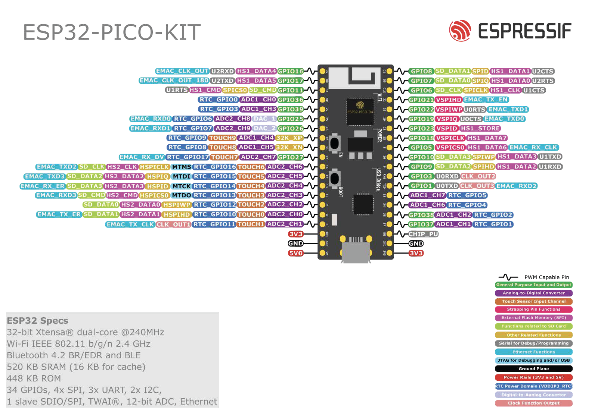

[](https://github.com/Gagan-Space/Cansat-Flight-Software/actions/workflows/test.yml)


# Orbit Navigator
This repository contains the flight software for a CanSat project known as Orbit Navigator. The software is meticulously crafted to operate on an ESP32 microcontroller utilizing the Arduino framework and PlatformIO, ensuring precise control and navigation during the CanSat's mission.

## Overview

Orbit Navigator serves as the central intelligence behind the CanSat's mission, orchestrating its journey with precision and reliability. From managing the CanSat's sensors to facilitating seamless communication with the ground station, Orbit Navigator ensures every aspect of the mission is executed flawlessly.

## ESP32 Pinout


## Hardware Connection
#### I2C Connections
| DPS310     | BNO085    | ESP32      |
|------------|-----------|------------|
| VIN        | VIN       | +5V        |
| SCL        | SCL       | GPIO19     |
| SDI        | SDA       | GPIO22     |
| GND        | GND       | GND        |


## Features
Flight Software has the following features:
- Integration with BNO085 and DPS310 sensors for accurate orientation and altitude measurement.
- Real-time data transmission to the ground station.
- Error handling and fault tolerance mechanisms.

with many more features on the way!

## Getting Started

### Setting up Development Enviorment
To set up your development environment, follow these steps:

1. Install Visual Studio Code (VS Code):
- Download and install VS Code from the [official website](https://code.visualstudio.com/).

2. Install PlatformIO Extension:
- Open VS Code.
- Go to the Extensions view by clicking on the square icon in the sidebar or pressing Ctrl+Shift+X.
- Search for "PlatformIO" in the Extensions Marketplace.
- Click on "Install" to install the PlatformIO extension.
- Restart VS Code after installation is complete.


### Cloning the Repository
To get started with the project, follow these steps:

1. Clone the repository to your local machine:

    ```bash
    git clone https://github.com/Gagan-Space/Cansat-Flight-Software.git
    ```
2. Open the project in Visual Studio Code (VS Code):

- Launch VS Code.
- Click on "File" > "Open Folder...".
- Navigate to the directory where you cloned the repository (Cansat-Flight-Software) and select it.
- The project will open in VS Code, and you can start working on it.

## Contributing

We welcome contributions from the community! If you'd like to contribute, please follow these guidelines:

1. Fork the repository
2. Create your feature branch: 
    ```bash
    git checkout -b feature-name
    ```
3. Commit your changes:
    ```bash
    git commit -am 'Add some feature'
    ```

4. Push to the branch: 
    ``` bash
    git push origin feature-name
    ```
5. Submit a pull request

For major changes, please open an issue first to discuss what you would like to change.